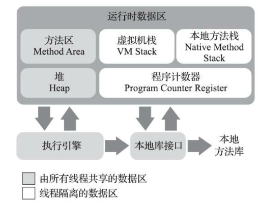
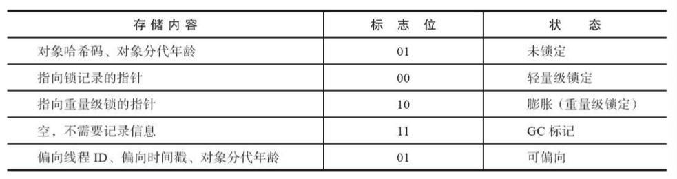

> 这章回答了自动内存管理的几个问题：
>
> 1. 内存是如何分布的？
>    1. 宏观的java虚拟机的运行时数据区
>    2. 微观的hotspot虚拟机的对象
> 2. 为什么要这么分布？从内存分布以及各个区域oom的场景，我们可以窥见这么分布的好处。（模块化，各司其职）

``

## 运行时数据区

> 宏观上java虚拟机的内存分布

``

### 线程隔离的数据区：

- 程序计数器：作为程序控制流的指示器，用于控制当前线程将要执行的字节码指令对应的行数。
- Java虚拟机栈：每个方法的执行与完成都是一个栈帧从压栈到出栈的过程。栈帧包含：局部变量表、操作数栈、动态链接、方法出口等信息。其中的局部变量表包含基本数据类型、对象引用、returnAddress。
- 本地方法栈：为虚拟机使用本地方法服务。
  ``

### 由所有线程共享的数据区：

- java堆：此内存区域唯一的目的就是存放对象实例与数组。几乎所有的对象都在这里分配，但在逃逸分析技术下通过栈上分配与标量替换，会让对象在栈上进行分配。注意堆在虚拟机规范中理论上仅分为普通堆与TLAB（每个线程私有的分配缓冲区）。
- 方法区：又称非堆。用于存储类型信息、常量、静态变量、即使编译器编译后的代码缓存等数据。
  - 运行时常量池：是方法区的一部分。存放编译期Class文件中的各种符号引用与字面量，同时运行期间产生的常量也可以放入常量池中，如String.intern()。注意1.7的hotspot虚拟机中，运行时常量池被放在java堆中。
    ``

### 非java虚拟机定义的内存区域：

- 直接内存：在NIO中的基于通道和缓冲区的IO方式，可以使用native函数直接分配堆外内存，然后通过存储在java堆中的direatByteBuffer对象引用这块内存进行操作。避免来回复制数据。其不受java堆大小限制，但受本地总内存限制。

``

## hotspot虚拟机对象

> 以下场景均在hotspot虚拟机下。
> 即微观下一个具体的虚拟机实现中，一个对象的内存分配

``

### 创建对象的过程：

> （不包含数据与Class对象）

1. 通过常量池定位类是否加载过，若无则先执行类加载过程。
2. 分配内存：通过指针碰撞或者空闲列表的方式分配内存空间，这取决于内存是否规整，即内存收集器的算法。
   1. 已启用TLAB：线程直接在对应的TLAB区域直接分配对象内存。
   2. 未启用TLAB：通过cas+失败重试机制，保证操作的原子性。
3. 初始化零值：
   1. 启用TLAB：在为线程分配TLAB时可以直接初始化。
   2. 未启用TLAB：初始化零值。
4. 设置对象头：类型数据、类型指针、mark word等。如果启用偏向锁，则还要设置偏向的线程信息。
5. 执行init方法，即构造函数。

``

### 对象的内存布局：

1. 对象头
   1. 运行时数据：Mark word，在不同状态下存储的数据不同：未锁定、偏向、轻量级锁定、重量级锁定、GC。见下图。
   2. 类型指针
2. 实例数据：包含父类与当前子类中定义的字段（即使父类的数据无权限访问）。
3. 对齐填充

注意：如果是数组，还要记录数组长度。` `

``

### 对象的访问定位：

> hotspot使用直接指针定位

- 如果使用句柄访问的话，Java堆中将可能会划分出一块内存来作为句柄池，reference中存储的就 是对象的句柄地址，而句柄中包含了对象实例数据与类型数据各自具体的地址信息.
  - 优点：垃圾收集后移动对象，此时reference无需修改，只要修改句柄的实例数据指针。
- 如果使用直接指针访问的话，Java堆中对象的内存布局就必须考虑如何放置访问类型数据的相关 信息，reference中存储的直接就是对象地址，如果只是访问对象本身的话，就不需要多一次间接访问的开销
  - 优点：速度快，只需一次指针定位。
  

``

## 实战OOM

> 各个内存区域出现OOM异常

``

### java 堆溢出：

- 内存泄漏：
  - 如果是内存泄漏，可进一步通过工具查看泄漏对象到GC Roots的引用链，找到泄漏对象是通过怎 样的引用路径、与哪些GC Roots相关联，才导致垃圾收集器无法回收它们，根据泄漏对象的类型信息 以及它到GC Roots引用链的信息，一般可以比较准确地定位到这些对象创建的位置，进而找出产生内存泄漏的代码的具体位置。
- 内存溢出：
  - 如果不是内存泄漏，换句话说就是内存中的对象确实都是必须存活的，那就应当检查Java虚拟机 的堆参数（-Xmx与-Xms）设置，与机器的内存对比，看看是否还有向上调整的空间。再从代码上检查 是否存在某些对象生命周期过长、持有状态时间过长、存储结构设计不合理等情况，尽量减少程序运行期的内存消耗。

``

### 虚拟机栈与本地方法栈溢出：

> hotspot虚拟机栈中不区分二者。

由于hotspot虚拟机不允许栈动态扩展，所以理论上只会出现容量不足而出现的StackOverFlowError。但如果创建线程时就无法获得足够内存，则会出现OOM。

- 多线程场景下，为每个线程分配到的栈内存越大，可以建立的线程数量自然就越少，建立线程时就越容易把剩下的内存耗尽。

``

### 方法区和运行时常量池溢出：

- 1.6，hotspot采用永久代实现方法区，运行时常量池也在其中，不断生成常量会使运行时常量池溢出，即方法区溢出，即永久代溢出。
- 1.7 时，hotspot将运行时常量池移到java堆中。
- 1.8的hotspot虚拟机中，方法区通过元空间，在直接内存中实现，而运行时常量池在java堆中。

**注意String.intern方法**：1.6会把首次遇到的字符串实例复制到永久代的字符串常量池 中存储，返回的也是永久代里面这个字符串实例的引用；1.7之后，既然字符串常量池已经移到Java堆中，那只需要在常量池里记录一下首次出现的实例引用即可。

**问题： 1.8中的元空间会垃圾回收吗？**` `答案：会。这里需要引出元空间的4个参数。` `·-XX：MetaspaceSize：指定元空间的初始空间大小，以字节为单位，达到该值就会触发垃圾收集 进行类型卸载，同时收集器会对该值进行调整：如果释放了大量的空间，就适当降低该值；如果释放 了很少的空间，那么在不超过-XX：MaxMetaspaceSize（如果设置了的话）的情况下，适当提高该值。` `·-XX：MaxMetaspaceSize：设置元空间最大值，默认是-1，即不限制，或者说只受限于本地内存 大小。` `·-XX：MinMetaspaceFreeRatio：作用是在垃圾收集之后控制最小的元空间剩余容量的百分比，可 减少因为元空间不足导致的垃圾收集的频率。类似的还有-XX：Max-MetaspaceFreeRatio，用于控制最大的元空间剩余容量的百分比。
